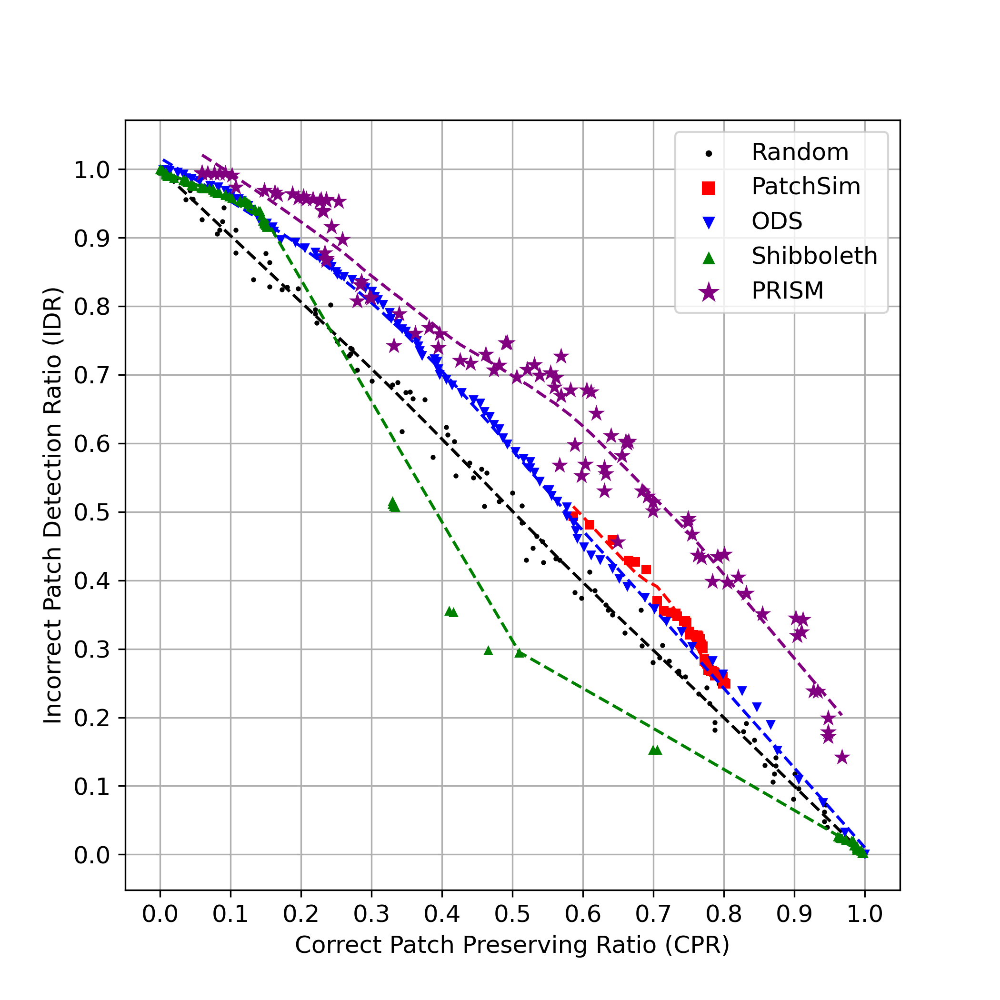

# PRISM
This repository provides artifact for the paper:

**"Enhancing APR with Prism: A Semantic-Based Approach to Overfitting Patch Detection.". We provide the following contents**

We provide:
- [Static analyzer](./analyzer): static analyzer of PRISM 
- [Dynamic test information extractor](./components/): dynamic analyzer to enhance static analyzer
- [the scripts and experimental data](./experiment): python scripts and experimental results

## Getting Started
To reproduce our results, we recommend using the provided Docker image. All instructions below assume the working directory is `/app` inside the container:
```
docker build -t prism-test .
docker run -it prism-test
```

## Benchmarks We Used
All benchmark patches used in our evaluation are located in [experiment/benchmarks](./experiment/benchmarks). Each patch follows a unified format:
```patch
--- [d4j-bug-dir]/[source_path]
+++ [d4j-bug-dir]/[source_path]
[unidiff-formatted patch contents]
```
 
## Evaluation Results
We provide complete experimental results for each evaluation. Specifically:
- [rq1_results](./experiment/rq1_results): Overall performance data of APR systems when combined with each APCC technique.
- [rq2_results](./experiment/rq2_results): Correct Patch Preservation Rate (CPR) and Incorrect Patch Discard Rate (IDR) values for various internal thresholds of each APCC technique.

## Reproducing Experimental Results in Paper
We provide scripts to reproduce all tables and figures from the paper.
Results may slightly differ due to non-determinism. Typos will be fixed in the camera-ready version.

### Rq1
```
cd /app/experiment/scripts
python3 rq1.py
```
This generates the following result table:
```
| APR           | APCC       | top-1 (Δ)   | top-5 (Δ)   | top-inf (Δ)   | #C (Δ)     | #I (Δ)      | #P-F (Δ)   | #P-L (Δ)    |
|---------------|------------|-------------|-------------|---------------|------------|-------------|------------|-------------|
| ar_gen        | patchsim   | 9 (-5)      | 12 (-6)     | 15 (-7)       | 24 (-43)   | 255 (-87)   | 236 (-14)  | 247 (-101)  |
|               | ods        | 6 (-8)      | 7 (-11)     | 7 (-15)       | 12 (-55)   | 32 (-310)   | 8 (-242)   | 18 (-330)   |
|               | shibboleth | 11 (-3)     | 17 (-1)     | 22            | 67         | 342         | 140 (-110) | 256 (-92)   |
|               | prism      | 15 (+1)     | 18          | 22            | 64 (-3)    | 298 (-44)   | 241 (-9)   | 319 (-29)   |
| -----         | -----      | -----       | -----       | -----         | -----      | -----       | -----      | -----       |
| coconut       | patchsim   | 8 (-1)      | 8 (-2)      | 8 (-2)        | 36 (-2)    | 64 (-6)     | 8 (-3)     | 69 (-3)     |
|               | ods        | 3 (-6)      | 4 (-6)      | 4 (-6)        | 11 (-27)   | 10 (-60)    | 5 (-6)     | 12 (-60)    |
|               | shibboleth | 5 (-4)      | 10          | 10            | 38         | 70          | 16 (+5)    | 74 (+2)     |
|               | prism      | 9           | 10          | 10            | 37 (-1)    | 36 (-34)    | 11         | 40 (-32)    |
| -----         | -----      | -----       | -----       | -----         | -----      | -----       | -----      | -----       |
| cure          | patchsim   | 9 (-4)      | 12 (-6)     | 12 (-6)       | 19 (-8)    | 118 (-14)   | 18 (-10)   | 32 (-17)    |
|               | ods        | 2 (-11)     | 3 (-15)     | 3 (-15)       | 4 (-23)    | 33 (-99)    | 4 (-24)    | 5 (-44)     |
|               | shibboleth | 13          | 15 (-3)     | 18            | 27         | 132         | 50 (+22)   | 65 (+16)    |
|               | prism      | 15 (+2)     | 18          | 18            | 27         | 91 (-41)    | 21 (-7)    | 38 (-11)    |
| -----         | -----      | -----       | -----       | -----         | -----      | -----       | -----      | -----       |
| edits         | patchsim   | 2           | 2           | 2             | 2          | 8           | 2          | 2           |
|               | ods        | 0 (-2)      | 0 (-2)      | 0 (-2)        | 0 (-2)     | 0 (-8)      | 0 (-2)     | 0 (-2)      |
|               | shibboleth | 2           | 2           | 2             | 2          | 8           | 2          | 2           |
|               | prism      | 2           | 2           | 2             | 2          | 8           | 2          | 2           |
| -----         | -----      | -----       | -----       | -----         | -----      | -----       | -----      | -----       |
| recoder       | patchsim   | 19 (-9)     | 20 (-9)     | 21 (-9)       | 22 (-11)   | 57 (-6)     | 28 (-9)    | 33 (-11)    |
|               | ods        | 7 (-21)     | 9 (-20)     | 9 (-21)       | 9 (-24)    | 24 (-39)    | 13 (-24)   | 13 (-31)    |
|               | shibboleth | 22 (-6)     | 28 (-1)     | 30            | 33         | 63          | 48 (+11)   | 58 (+14)    |
|               | prism      | 28          | 29          | 30            | 33         | 41 (-22)    | 37         | 40 (-4)     |
| -----         | -----      | -----       | -----       | -----         | -----      | -----       | -----      | -----       |
| reward_repair | patchsim   | 18 (-7)     | 21 (-7)     | 22 (-7)       | 82 (-25)   | 158 (-12)   | 33 (-7)    | 143 (-36)   |
|               | ods        | 9 (-16)     | 11 (-17)    | 11 (-18)      | 32 (-75)   | 53 (-117)   | 15 (-25)   | 37 (-142)   |
|               | shibboleth | 20 (-5)     | 27 (-1)     | 29            | 107        | 170         | 61 (+21)   | 197 (+18)   |
|               | prism      | 26 (+1)     | 29 (+1)     | 29            | 106 (-1)   | 117 (-53)   | 34 (-6)    | 141 (-38)   |
| -----         | -----      | -----       | -----       | -----         | -----      | -----       | -----      | -----       |
| selfapr       | patchsim   | 22 (-7)     | 25 (-7)     | 26 (-7)       | 144 (-80)  | 171 (-4)    | 47 (-7)    | 209 (-82)   |
|               | ods        | 12 (-17)    | 13 (-19)    | 13 (-20)      | 70 (-154)  | 56 (-119)   | 14 (-40)   | 87 (-204)   |
|               | shibboleth | 27 (-2)     | 32          | 33            | 224        | 175         | 62 (+8)    | 299 (+8)    |
|               | prism      | 29          | 32          | 33            | 224        | 165 (-10)   | 54         | 285 (-6)    |
| -----         | -----      | -----       | -----       | -----         | -----      | -----       | -----      | -----       |
| sequencer     | patchsim   | 6 (-7)      | 9 (-7)      | 10 (-7)       | 15 (-10)   | 79 (-9)     | 22 (-7)    | 47 (-11)    |
|               | ods        | 3 (-10)     | 3 (-13)     | 4 (-13)       | 4 (-21)    | 22 (-66)    | 9 (-20)    | 9 (-49)     |
|               | shibboleth | 12 (-1)     | 16          | 17            | 25         | 88          | 35 (+6)    | 65 (+7)     |
|               | prism      | 15 (+2)     | 16          | 17            | 25         | 55 (-33)    | 25 (-4)    | 39 (-19)    |
| -----         | -----      | -----       | -----       | -----         | -----      | -----       | -----      | -----       |
| simfix        | patchsim   | 12 (-2)     | 12 (-3)     | 12 (-3)       | 12 (-3)    | 20 (-2)     | 12 (-4)    | 12 (-4)     |
|               | ods        | 3 (-11)     | 3 (-12)     | 3 (-12)       | 3 (-12)    | 1 (-21)     | 3 (-13)    | 3 (-13)     |
|               | shibboleth | 15 (+1)     | 15          | 15            | 15         | 22          | 15 (-1)    | 15 (-1)     |
|               | prism      | 14          | 15          | 15            | 15         | 17 (-5)     | 16         | 16          |
| -----         | -----      | -----       | -----       | -----         | -----      | -----       | -----      | -----       |
| tbar_gen      | patchsim   | 22 (-7)     | 26 (-7)     | 28 (-9)       | 36 (-15)   | 195 (-83)   | 84 (-58)   | 153 (-66)   |
|               | ods        | 13 (-16)    | 14 (-19)    | 15 (-22)      | 15 (-36)   | 46 (-232)   | 29 (-113)  | 29 (-190)   |
|               | shibboleth | 25 (-4)     | 29 (-4)     | 37            | 51         | 278         | 126 (-16)  | 275 (+56)   |
|               | prism      | 32 (+3)     | 34 (+1)     | 37            | 49 (-2)    | 191 (-87)   | 96 (-46)   | 166 (-53)   |
| -----         | -----      | -----       | -----       | -----         | -----      | -----       | -----      | -----       |
| TOTAL         | patchsim   | 127 (-49)   | 147 (-54)   | 156 (-57)     | 392 (-197) | 1125 (-223) | 490 (-119) | 947 (-331)  |
|               | ods        | 58 (-118)   | 67 (-134)   | 69 (-144)     | 160 (-429) | 277 (-1071) | 100 (-509) | 213 (-1065) |
|               | shibboleth | 152 (-24)   | 191 (-10)   | 213           | 589        | 1348        | 555 (-54)  | 1306 (+28)  |
|               | prism      | 185 (+9)    | 203 (+2)    | 213           | 582 (-7)   | 1019 (-329) | 537 (-72)  | 1086 (-192) |
```

### Rq2
```
cd /app/experiment/scripts
python3 rq2.py
```
This generates the following figure:



### Rq3
```
cd /app/experiment/scripts
python3 rq3.py
```
This produces the following table:
```
| Feature Type   | RF@70%    | PRISM@70%   | RF@80%    | PRISM@80%   | RF@90%    | PRISM@90%   |
|----------------|-----------|-------------|-----------|-------------|-----------|-------------|
| Syn            | 638 (48%) | 650 (49%)   | 405 (30%) | 375 (28%)   | 265 (20%) | 135 (10%)   |
| Sem            | 623 (47%) | 672 (51%)   | 484 (37%) | 572 (43%)   | 339 (25%) | 451 (34%)   |
| Syn+Sem        | 649 (49%) | 723 (55%)   | 422 (32%) | 544 (41%)   | 167 (12%) | 340 (26%)   |
```


## Guide for Running Each APCC Tools
Our artifact also provide scripts for running the all APCC techniques used in our evaluations. All the results will be stored in [experiment/outputs](./experiment/outputs). We also provide the outputs data used in our evaluations. See the [outputs README](./experiment/outputs/README.md) for more details.

### PRISM
For running PRISM, build INFER and our dynamic tracer:
```
# 1. Build PRISM analyzer
cd /app/analyzer
./build_infer.sh java
sudo make install

# 2. Build tracer
cd /app/compoments
mvn package
```

To extract semantic features from the given patch type the following commands:
```
cd /app/experiment/scripts

# compile the both the original and patch code
python3 run.py --patch [patch_path] --mode prism-capture

# extract the dynamic informattion from the original and patch code
python3 run.py --patch [patch_path] --mode prism-trace

# analyze each code and extract semantic features
python3 run.py --patch [patch_path] --mode prism-run
```

The resulting feature vector will be stored in `experiment/outputs/[bugid]/[patchid]/prism/result.json`

### PatchSim
For running PatchSim, compile PatchSim binaries
```
cd /app/experiment/tools/PatchSim/tool/source/
make build
javac classifier.java
```

Running PatchSim with given patch is conducted by following command:
```
cd /app/experiment/scripts
python3 run.py --patch [patch_path] --mode patchsim
```

The result will be stored in `experiment/outputs/[bugid]/[patchid]/patchsim/result.json`

### ODS
To extract the syntactic featrues used in ODS, compile [coming](./experiment/tools/coming).
```
cd /app/experiment/tools/coming
coming mvn package
```

Extracting ODS's syntactic feature is conducted as following:
```
cd /app/experiment/scripts
python3 run.py --patch [patch_path] --mode ods-extract
```

The feature vector will be stored in `experiment/outputs/[bugid]/[patchid]/ods/feature.json`

### Shibboleth
Shibboleth also requires method signature metadata at `experiment/outputs/[bugid]/[patchid]/patch_mthds.results` in the following format:
```
[class_name]/[method_name]/[arguments]
```

Running shibboleth with the following command:
```
cd /app/experiment/scripts
python3 run.py --patch [patch_path] --mode shibboleth-extract
```

The feature vector will be stored at `experiment/outputs/[bugid]/[patchid]/shibboleth/score.csv`

## Classifying Patches by APCCs
We also provide the script for classifying the patches based on each APCC's result:
```
cd /app/experiment/scripts
python3 classify.py --patch [patch_path] --apcc [prism|patchsim|ods|shibboleth]
```
